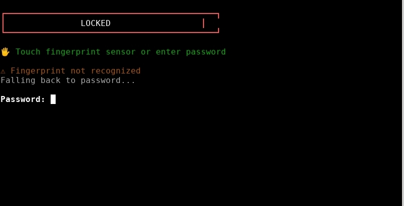

# LMSEC - Lamgerr Security Lock System



A hardened terminal lock system for Termux with biometric authentication support. Built for developers who need to secure their workstations without compromising on speed or usability.

[](https://opensource.org/licenses/MIT)
[](https://www.python.org/downloads/)
[](https://termux.dev/)

## Features

- **🖐 Fingerprint Authentication** - Native Android biometric via Termux:API
- **🔐 PBKDF2-SHA256** - 200,000 iterations password hashing
- **🛡️ Watchdog Daemon** - Kills shell if lock process is terminated
- **🔒 Signal Blocking** - Immune to Ctrl+C, Ctrl+Z, SIGTERM
- **⏱️ Monotonic Lockout** - Clock manipulation resistant
- **📝 Audit Logging** - Full authentication trail with TTY tracking
- **🧹 Scrollback Clearing** - Prevents terminal history exposure
- **✅ Config Integrity** - HMAC verification detects tampering

## Quick Start

```bash
# Clone the repository
git clone https://github.com/NaveenSingh9999/LMWM.git
cd LMWM

# Install Termux:API for fingerprint support (optional)
pkg install termux-api

# Setup password
python3 LMSEC.py --setup

# Test the lock
python3 LMSEC.py --lock

# Add to bashrc for auto-lock on terminal start
echo 'python3 ~/LMWM/LMSEC.py --lock' >> ~/.bashrc
```

## Usage

```
Usage: python3 LMSEC.py [option]

Options:
  --setup     Configure/reset password
  --lock      Lock the terminal
  --status    Show status and audit logs
  --remove    Remove LMSEC completely
  --help      Show help information
```

## Requirements

| Requirement | Purpose | Required |
|-------------|---------|----------|
| Python 3.8+ | Runtime | Yes |
| Termux | Environment | Yes |
| termux-api | Fingerprint auth | Optional |
| Termux:API App | Android bridge | Optional |

## Architecture

```
┌─────────────────────────────────────────────────────────┐
│                    LMSEC v2.1                           │
├─────────────────────────────────────────────────────────┤
│  ┌─────────────┐  ┌─────────────┐  ┌─────────────┐     │
│  │ Fingerprint │  │  Password   │  │   Watchdog  │     │
│  │    Auth     │  │    Auth     │  │   Daemon    │     │
│  └──────┬──────┘  └──────┬──────┘  └──────┬──────┘     │
│         │                │                │             │
│         └────────┬───────┘                │             │
│                  ▼                        ▼             │
│  ┌─────────────────────────┐  ┌─────────────────────┐  │
│  │    LockoutManager       │  │   Shell Monitor     │  │
│  │  (Monotonic Time)       │  │  (Kill on Bypass)   │  │
│  └─────────────────────────┘  └─────────────────────┘  │
│                  │                        │             │
│                  ▼                        ▼             │
│  ┌─────────────────────────────────────────────────┐   │
│  │              Config Store (.session-manager)     │   │
│  │         HMAC Integrity | 0600 Permissions        │   │
│  └─────────────────────────────────────────────────┘   │
└─────────────────────────────────────────────────────────┘
```

## Security Implementation Details

### Password Hashing

```python
# PBKDF2-SHA256 with high iteration count
key = hashlib.pbkdf2_hmac(
    'sha256',
    password.encode('utf-8'),
    salt,  # 32 bytes random
    200000,  # iterations - resistant to GPU attacks
    dklen=32
)
```

**Why PBKDF2?**
- CPU-intensive by design, slows brute-force attacks
- 200k iterations ≈ 100-200ms per attempt on mobile
- NIST recommended for password storage

### Config Integrity (HMAC)

```python
def compute_config_mac(config_data: bytes, key: bytes) -> str:
    """Machine-bound HMAC prevents config tampering."""
    return hmac.new(key, config_data, hashlib.sha256).hexdigest()

def generate_integrity_key() -> bytes:
    """Derive key from machine-specific entropy."""
    components = [
        machine_id,      # /etc/machine-id
        android_serial,  # ro.serialno
        uid,             # Process UID
        home_path        # $HOME
    ]
    return hashlib.sha256('|'.join(components)).digest()
```

**Attack Mitigated:** Attacker cannot simply edit `config.json` to reset failed attempts or replace password hash.

### Monotonic Time Lockout

```python
def get_monotonic_time() -> float:
    """Immune to system clock manipulation."""
    return time.monotonic()  # Kernel uptime, not wall clock
```

**Attack Mitigated:** `date -s "2025-01-01"` won't bypass lockout timer.

### Watchdog Daemon

```python
class WatchdogDaemon:
    """Monitor lock process, kill shell on bypass."""
    
    def _monitor(self):
        while self.running:
            time.sleep(0.5)
            if not self._is_process_alive(self.lock_pid):
                # Lock was killed! Security breach!
                os.kill(self.parent_pid, signal.SIGKILL)
```

**Attack Mitigated:** `kill -9 <lock_pid>` from another terminal results in shell termination.

### Signal Blocking

```python
signals_to_block = [
    signal.SIGINT,   # Ctrl+C
    signal.SIGTSTP,  # Ctrl+Z
    signal.SIGQUIT,  # Ctrl+\
    signal.SIGTERM,  # kill <pid>
    signal.SIGHUP,   # Terminal hangup
    signal.SIGUSR1, signal.SIGUSR2,
    signal.SIGPIPE, signal.SIGALRM,
]
for sig in signals_to_block:
    signal.signal(sig, signal.SIG_IGN)
```

**Note:** `SIGKILL` (kill -9) cannot be blocked by any userspace process - this is a kernel limitation.

### Fingerprint Authentication

```python
def authenticate_fingerprint() -> Tuple[bool, str]:
    """Android Biometric API via Termux:API."""
    result = subprocess.run(
        ['/data/data/com.termux/files/usr/bin/termux-fingerprint'],
        capture_output=True, text=True, timeout=15
    )
    response = json.loads(result.stdout)
    
    # AUTH_RESULT_SUCCESS = Fingerprint matched
    # AUTH_RESULT_FAILURE = Wrong finger
    # AUTH_RESULT_UNKNOWN = Cancelled/timeout
    return response['auth_result'] == 'AUTH_RESULT_SUCCESS'
```

**Flow:**
1. Lock screen displays fingerprint prompt
2. `termux-fingerprint` calls Android `BiometricPrompt`
3. On success → immediate unlock
4. On failure → fallback to password

## File Structure

```
~/.config/.session-manager/
├── .state      # Password hash, salt, config (HMAC protected)
├── .active     # Lock file (exists when locked)
├── .audit      # Authentication log
└── .verify     # Integrity verification data
```

All files are `chmod 600` (owner read/write only).

## Known Limitations

| Limitation | Reason | Mitigation |
|------------|--------|------------|
| `kill -9` from another session | SIGKILL cannot be caught | Watchdog kills parent shell |
| Root access bypass | Root owns everything | Use Android FDE |
| New terminal windows | No PAM integration | Consider Termux:Boot |
| Memory extraction | Python GC | SecureString wrapper (best effort) |

## Comparison with Alternatives

| Feature | LMSEC | termux-lock (Akash) | Screen Lock Apps |
|---------|-------|---------------------|------------------|
| Fingerprint | ✅ | ❌ | ✅ |
| Password Hashing | PBKDF2 200k | Plain text | Varies |
| Brute Force Protection | ✅ 5 attempts | ❌ | ✅ |
| Kill Protection | Watchdog | ❌ | N/A |
| Config Tampering | HMAC | ❌ | N/A |
| Signal Blocking | 9 signals | 3 signals | N/A |
| Audit Log | ✅ | ❌ | ❌ |

## Contributing

Contributions welcome! Areas of interest:

- [ ] PAM module for true multi-session lock
- [ ] Encrypted SSH key storage during lock
- [ ] Remote lock via SMS (Termux:API)
- [ ] Yubikey/FIDO2 support
- [ ] Rust rewrite for memory safety

```bash
# Fork, clone, create branch
git checkout -b feature/amazing-feature

# Make changes, test
python3 LMSEC.py --setup
python3 LMSEC.py --lock

# Submit PR
```

## License

MIT License - Use it, modify it, ship it. See [LICENSE](LICENSE) for details.

```
Copyright (c) 2025 Lamgerr (NaveenSingh9999)

Permission is hereby granted, free of charge, to any person obtaining a copy
of this software and associated documentation files (the "Software"), to deal
in the Software without restriction, including without limitation the rights
to use, copy, modify, merge, publish, distribute, sublicense, and/or sell
copies of the Software...
```

## Author

**Lamgerr** (NaveenSingh9999)

- GitHub: [@NaveenSingh9999](https://github.com/NaveenSingh9999)
- Project: LMWM (Lamgerr Workspace Manager)

---

<p align="center">
  <i>Built for developers who take security seriously.</i>
</p>
